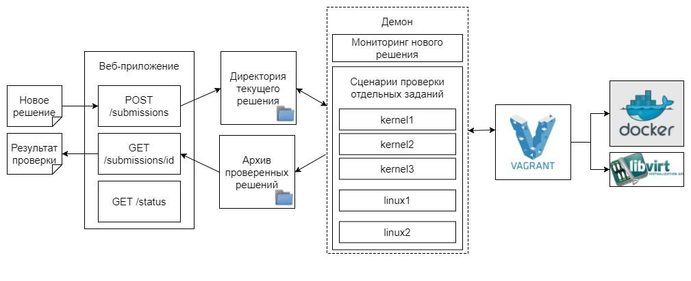

# Реализация системы автоматической проверки задач для MOOC "Программирование для Linux"
## Аннотация
В данной работе описывается один из возможных вариантов автоматизации лабораторных работ студентов путем виртуализация среды для их проверки на примере онлайн-курсов _“Основы программирования для Linux"_ и _"Программирование модулей ядра Linux”_. Задания представляют собой лабораторные работы, в рамках которых студенту необходимо разработать программу на языке С и Makefile. Процедура проверки включает в себя компиляцию, запуск и интерпретацию результатов работы студенческого решения. Для данной процедуры система обеспечивает исключение взаимного влияния решений друг на друга, подготовку унифицированной среды сборки решения, многократную воспроизводимость результатов проверки одного и того же решения

## Введение


##### # Обзор предметной области
\# TODO

## Выбор метода решения
Система автоматической проверки лабораторных работ должна представлять из себя комплекс взаимосвязанных программных средств, позволяющих студенту загрузить разработанную им программу и получить ответ о ее корректности, а так же логи сборки, запуска и информацию о произошедших ошибках при их наличии.

Система должна обеспечивать:
- Получение решения от студента
- Проверку корректности формата решения
- Сборку решения
- Запуск решения
- Проверку работы решения
- Отправку результатов решения обратно студенту

Система должна обеспечить изолированность проверяемого решения от внешней среды, чтобы обеспечить достаточный уровень надежности и безопасности исполнения. Помимо этого также необходимо исключить взаимное влияние решений друг на друга для того, чтобы не дать возможность студенту случайно или намеренно повлиять на работу другого студента или просмотреть его. Среда, в которой происходит проверка, должна быть одинаковой для всех решений, чтобы обеспечить как одинаковые условия проверки различных решений, так и многократную воспроизводимость результатов проверки одного и того же решения.

## Описание метода решения
Система состоит из двух связанных компонент: веб-приложения и демона.

### Веб-приложение
Веб-приложение написано на языке программирования Python с использованием библиотеки Flask. Оно позволяет студенту загрузить свое решение и получить результаты его проверки через специальные HTTP-запросы:
1. ```POST /submissions``` - позволяет загрузить решение в систему. Запрос содержит идентификатор решения, исходный код и Makefile в формате JSON.
2. ```GET /submissions/<submission_id>``` - позволяет получить информацию о том, на каком этапе проверки находится решение. При окончании проверки данный запрос также содержит лог-файлы сборки и исполнения.
3. ```GET /status``` - выводит состояние сервера.

Алгоритм работы системы состоит из нескольких этапов. При получении решения, веб-приложение сохраняет его в локальное хранилище на сервере. Демон, обнаружив, что в локальной директории появилось новое решение, в зависимости от задания выбирает соответствующий сценарий проверки и запускает виртуальную машину, на которой запускается набор скриптов, собирающих и запускающих решение, а так же проверяющего его. После окончания проверки, результаты, включая логи сборки и исполнения, выгружаются из виртуальной машины, после чего она выключается.

Полная схема проверяющей системы представлена на рис. 1.


Рис. 1: Архитектура системы

## Заключение

## Список литературы
