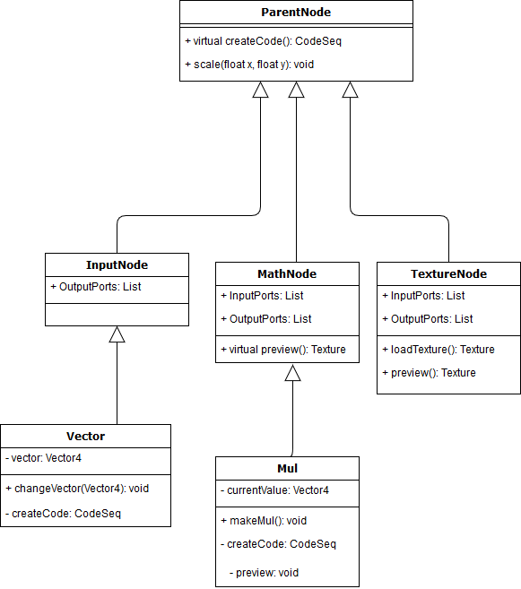

# Разработка редактора для визуального программирования и отладки шейдеров в Unity

## Аннотация
Процесс создания шейдеров в Unity зачастую требует больших временных затрат и шейдеры не всегда удобно отлаживать, кроме того шейдеры часто используют 3D и VFX-художники, которые могут быть не знакомы с шейдерным программированием. Для упрощения задачи можно использовать визуальное программирование, поскольку это позволяет быстро и удобно создавать необходимые наработки.

Предлагаемое решение предоставляет возможности для создания шейдеров с помощью визуального программирования. В данный момент решение находится в ранней стадии разработки, а потому не имеет широких возможностей. В рамках работы представлено описание системы узлов, а так же принятые решения по поводу необходимых команд и способов предпросмотра шейдера и его составляющих.  

## Введение
В современное время все чаще появляется необходимость в шейдерах, поскольку постоянно растут требования к качеству рендера или к параллельной обработке данных. Однако, сам процесс создания шейдеров требует знаний программирования шейдеров и происходит обычным написанием его в текстовых редакторах с подсветкой синтаксиса. Сфера компьютерной графики манипулирует визуальными образами, а потому визуальное программирование в этой сфере очень практично, т.к. позволяет перейти от написания текстового кода к манипулированию визуальными образами. Это упрощает работу для процесса создания шейдеров и их отладки, поскольку можно видеть промежуточный результат работы шейдера и быстро изменять параметры в реальном времени даже без знания программирования шейдеров или кокнретного языка шейдеров. Некоторые движки(например Unreal Engine 4) уже создали собсnвенные варианты подобных редакторов, однако в других движках(Unity) такие возможности отсутствуют.

Основной проблемой является удобство процесса разработки шейдеров в движках, вроде Unity. Unity использует собственный шейдерный язык ShaderLab, тесно связанный с возможностями движка, однако так и не предоставил хороших инструментов для работы с шейдерами. Так, для отладки какой-либо операции необходимо записывать ее в конкретный выходной параметр шейдера(например, Emission), создавать материал использующий такой шейдер и смотреть его уже на сцене. Зачастую это отнимает много времени, что критично может сказаться на процессе разработки. Поэтому основной целью является упростить этот процесс при помощи визуального программирования. Для выполнения этой цели необходимо совершить анализ уже существующих аналогов как для других движков, так и плагинов в Unity, составить ключевые требования для решения и оценить(по возможности и спроектировать) систему узлов для визуального программирования. 

## Сравнение аналогов
### ShaderForge(SF)
Плагин под названием ShaderForgе предоставляет интерфейс для визуального программирования шейдеров и библиотеку узлов для программирования и отладки. Основными особенностями является поддержка пользовательской модели освещения и поддержки PBR (Physically-Based Rendering). ShaderForge является первым плагином для визуального программирования шейдеров в Unity. Имеет собственный дизайн интерфейса, отличный от интерфейса Unity.

### Amplify Shader Editor(ASE)
Amplify Shader Editor находится в состоянии бета-тестирования. Данный продукт получил награду "лучший плагин 2017 года для Unity" и соблюдает стиль интерфейса самого движка Unity. Постоянно развивается и на данный момент имеет такие возможности как создание собственных функций и шаблонов.

### Unreal Material Editor(UME)
Unreal Material Editor является редактором визуального программирования шейдеров для движка Unreal Engine. Является одним из первых таких редакторов и развивается разработчиками самого движка Unreal. Является аналогом по своему функционалу и решениям по дизайну интерфейса. В частности предлагает удобные возможности для препросмотра результата шейдера. 

### Критерии сравнения аналогов

#### Удобство
Данный критерий оценивался по тому, насколько много шагов необходимо сделать для добавления, изменения или удаления узлов, кол-ву примеров и подробности документации.

#### Расширяемость 
Расширяемость подразумевает собой возможность добавлять новые или изменять функции-узлы в редакторе. Критерий оценивался по способу добавления: через API и при помощи встроенных возможностей.

#### Гибкость
Данный критерий показывает наличие возможностей подстроить управление или интерфейс под нужды пользователя. 

### Таблица сравнения по критериям
Критерий \ Аналог | ShaderForge | Amplify Shader Editor | Unreal Material Editor
------------ | ------------- | ------------- | ------------- 
Удобство | Высокое | Среднее | Высокое
Расширяемость | Встроенные возможности  | Встроенные возможности \ через API | через API
Гибкость | - | через API | -

### Выводы по итогам сравнения
В соответствии с приведенными выше данными каждый из плагинов для Unity(ASE и SF) имеет своими плюсы и свои минусы. ASE предлагает широкие возможности по масшатбируемости и гибкости, позволяя тем самым подстроить редактор под себя, а так же использует привычный для Unity дизайн интерфейса. Это позволяет работать с редактором, как с другими окнами в Unity. SF же предлагает больше функционала, в частности большое кол-во различных дополнительных функциональных узлов, однако имеет собственный дизайн интерефейса, что может негативно сказываться при переходе с интерфейса Unity на новый и наоборот. UME предлагает хорошие и удобные возможности для предпросмотра результата выполнения шейдера(или его части), что позволяет не использовать другие окна для создания и отладки шейдеров.  

## Выбор метода решения
Решение представляет собой плагин для движка Unity, позволяющий создавать шейдеры при помощи визуального программирования. Каждая операция (или группа операций) в шейдере представляется в виде графических узлов, которые связываются между собой через входные и выходные порты. По графу таких узлов в итоге создается код шейдера, который подставляется в нужное место заранее созданного шаблона шейдера.

Исходя из обзора существующих решений, можно сказать что решение должно быть гибким (Пользователь должен иметь возможность настраивать интерфейс или горячие клавиши) и масштабируемым (Должны быть возможности для создания собственных узлов). Решение также должно быть понятным для пользователей, не знакомых с шейдерным программированием, и предоставлять возможности для отладки шейдеров, показывая текущий реультат выполнения шейдера при конкретных параметрах и значениях.

Таким образом, ключевые требования можно описать следующим образом:

* Содержание узлов для всех шейдерных операций из языка ShaderLab, используемого в Unity;
* Интерфейс выполнен в едином стиле, схожим со стандартным интерфейсом в Unity;
* Возможность добавлять собственные узлы и функции;
* Возможность добавлять собственные шаблоны для шейдера;
* Возможность предпросмотра результата выполнения шейдера(или конкретной его операции) при заданных параметрах на выбранном объекте;
* Наличие доступа к документации и всплывающих окон с подсказками;
* Возможность изменения\добавления горячих клавиш и макросов, а также наличие поддержки стандартных функций, как Копировать, Вставить, Назад, Вперед;
* Созданный код шейдера должен быть понятен и не нагружать шейдер лишними переменными.

## Описание решения
Далее описаны решения по поводу реализации требований.

### Узлы ShaderLab
Все операции языка ShaderLab можно разделить на следующие типы:

* Постоянные (Константы);
* Логические операторы (If);
* Математические операторы (floor, cos);
* Операции над текстурами;
* Операции над вершинами;
* Преобразования системы координат(TransformWorldToLocal).
* Время 

Каждый тип имеет свой набор операций со своими особенностями. К примеру, константы никогда не будут имеют входные порты на узлах, в то время как текстуры имеют в качестве входного параметра координаты UV. Однако, каждый узел должен иметь одинаковый интерфейс для генерации кода, чтобы упростить задачу обработки графа при создании шейдера.

Особенность языка ShaderLab в том, что он тесно связан с возможностями интерфейса Unity. Многие свойства(Properties) шейдера могут иметь свои аттрибуты, влияющие на диапазон значений или привязывающие это св-во к материалу, делая его не глобальным. Эти параметры необходимо учитывать при создании св-в шейдера, поэтому каждый узел должен иметь определенные поднастройки для аттрибутов. Полный перечень аттрибутов можно посмотреть в документации Unity.

Самый простой(и расширяемый) вариант для системы узлов является дерево. В качестве корня используется класс, содержащий в себе общий для всех интерфейс (логика генерации кода, обработка событий, масштабирование и т.п.). Следующий уровень будет разделение на конкретные типы узлов, в которых лучше всего реализовать создание конкретной формы узла и логику показа предварительной картинки, а дальше уже будет непосредственно классы, реализующие логику узлов и конкретных операций в шейдере. Пример такого дерева представлен на рисунке 1.

В рамках языка ShaderLab можно выделить еще один тип операций - операции цикла и массивов. В виду сложности их разработки для визуального программирования (возникает вопрос зацикленности самого графа), данный тип пока не рассматривается в ближайшей разработке. В качестве альтернативы предлагается использования собственного шаблона шейдера, где часть графа будет отдельно записываться в цикл, а результат цикла использоваться далее уже под конкретным именем. 

### Собственные узлы и функции
Используя систему узлов, предложенную выше, можно создавать собственные узлы при помощи расширения дерева узлов. Однако, для людей, не занимающихся программированием, это может быть достаточно тяжело, поэтому предлагается использовать редактор функций. Редактор функций представляет собой такой же редактор для визуального программирования шейдеров, но имеет в себе дополнительные создаваемые узлы - входные и выходные узлы(Input и Output соответственно). Эти узлы будут являться входными и выходными портами создаваемого узла, а в качестве набора операций будет использоваться граф, созданный между этими узлами. 

### Шаблоны шейдера
Вариантов использования шейдеров очень много и создать универсальный шаблон не получится. Из наиболее часто используемых шаблонов можно выделить стандартный для Unity Surface Shader, который указывает материалу данные для физически корректного рендера(Physically based rendering).

В случае если пользователю недостаточно стандартных шейдеров, ему может потребоваться создать свой шаблон и свой список выходных данных. Для этого предлагается написать свой шейдер с определенной разметкой, вместо которой после генерации кода шейдера будет находиться необходимая часть дерева. В качестве примера можно привести следующую строку: **float dist = |"Distance", 2|**. После генерации шейдера будет создана другая строка, которая использует код, созданный из дерева, исходящего от второго параметра под названием Distance в списке выходных данных.

### Предпросмотр
Предпросмотр является одним из наиболее важных требований для динамичных шейдеров, поскольку необходимо постоянно отслеживать динамику формы, цвета или геометрии. В Unity имеется встроенное окно предпросмотра материалов и шейдеров, однако оно имеет достаточно ограниченные возможности, поэтому для редактора реализовано собственное окно предпросмотра, в котором можно загрузить собственную модель, а так же подключить необходимые шейдеры пост-обработки. 

Помимо окна предпросмотра, каждый узел содержит в себе окно, в котором показывается текущее состояние операции. К примеру, если узел работает с текстурой, то показывается видоизмененная текстура прямо на узле. Для этого генерируется шейдер до заданной операции и выводится результат шейдера. Однако, при большом кол-ве операций такой подход может быть не самый производительный, поэтому требуется дополнительное тестирование и оптимизация такого предпросмотра. 

### Интерфейс 
Для сохранения стандартного макета и стиля Unity, окно редактора наследуется от класса EditorWindow. Это позволяет переносить окно редактора, скрывать его среди вкладок уже в существующем макете и использовать его как стандартное окно в Unity. 

Для реализации стандартных действий, вроде Копировать, Вставить, Назад, Вперед и сохранения логов действий пользователя используется шаблон проектирования Команда.[5] Все действия на сцене вызываются через единый интерфейс Action, что позволяет возвращать редактор к состоянию предыдущих действий, а так же позволяет отслеживать и логировать историю действий пользователя в случае ошибки.

### Генерация кода 
Генерация кода шейдера происходит рекурсивно, выполняясь с конца(проходя по списку выходных параметров). Основными принципами при генерации кода является использование наименьшего кол-ва временных переменных, поскольку они способны сильно затруднить чтение кода, и использование понятных названий таких переменных. 

Пользователь так же может лично отслеживать удоство чтения кода при помощи определенных узлов - создание переменной и чтение переменной. Организуя граф на функциональные участки с конкретными результатами пользователь способен получить более понятный код. 

## Заключение
Текущее решение упрощает процесс создания шейдеров, однако на данный момент не предлагает широких возможностей. В процессе работы представлена возможная реализация системы узлов, описаны решения для создания команд, а так же описаны способы предпросмотра и создания собственных узлов и шаблонов. Решение не прошло полного тестирования, а потому может потребоваться оптимизация алгоритма предпросмотра или доработки архитектуры. Так же требуется постоянное пополнение библиотеки узлов для большего упрощения работы. В данный момент решение слабо отличается от аналогов, а потому требуется продумать и реализовать отличительные особенности от готовых решений. 

В дальнейших планах изучить более мощные инструменты для создания шейдеров, основанные на визуальном программировании, например, Houdini, провести полное тестирование, а так же продумать добавление возможности работы с циклами и шагами(Passes). 

## Список литературы
1. Alan Zucconi, Kenneth Lammers. Unity 5.x Shaders and Effects Cookbook // Packt Publishing Ltd, 2016
2. Kenny Lammers. Unity Shaders and Effects Cookbook // Packt Publishing Ltd, 2013
3. Jamie Dean. Mastering Unity Shaders and Effects // Packt Publishing Ltd, 2016
4. Claudia Doppioslash. Physically Based Shader Development for Unity 2017 // Apress, 2017
5. Erich Gamma, Richard Helm, Ralph Johnson, John Vlissides. Design Patterns: Elements of Reusable Object-Oriented Software // USA, Addison-Wesley, 1994
