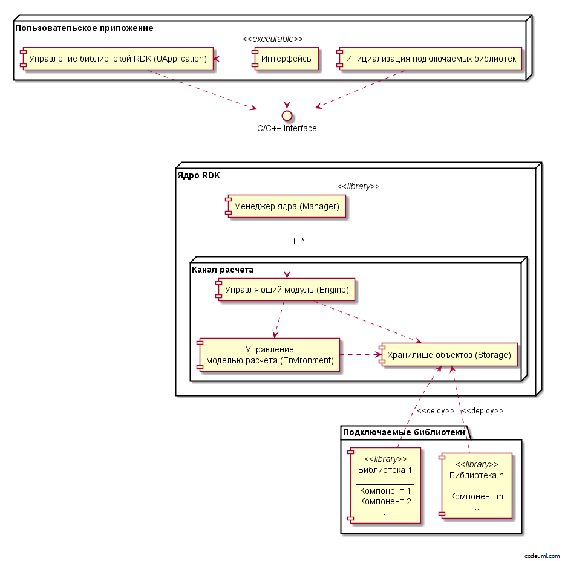
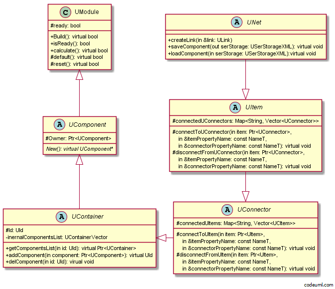
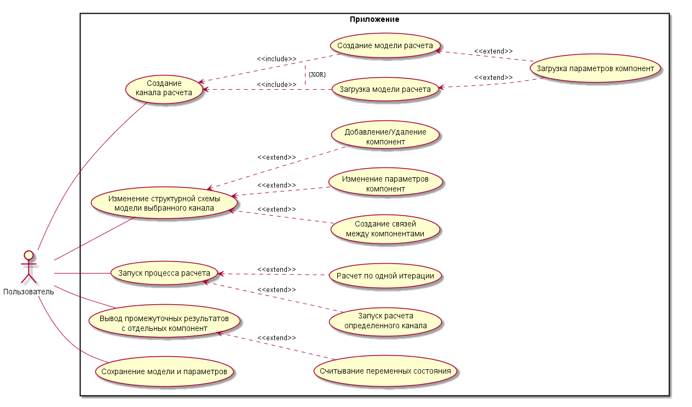

# Программный комплекс для разработки программ с модульной динамически изменяемой структурой алгоритма

## Аннотация
В процессе жизненного цикла сложных вычислительных систем, возникает ряд архитектурных трудностей при необходимости расширения функционала или настройки всей системы. В статье описывается программный комплекс, основанный на идее модульности, позволяющий формировать сложные вычислительные системы, путем комбинирования отдельных вычислительных модулей в общую сеть. Рассматриваются особенности модулей и общее устройство архитектуры подобной системы.

## Введение
Разделение крупной вычислительной задачи на небольшие логические блоки, является хорошей практикой программирования и позволяет без больших затрат сопровождать и отлаживать крупные вычислительные программы. Недостатоками подобной декомпозиции являются уменьшение производительности вычислений, за счёт накладных расходов на реализацию модульности и коммуникаций между модулями, усложнение кода приложения, вызванного дополнительной логикой работы с модулями.

Решаемой задачей является разработка программного комплекса для моделирования вычислительных алгоритмов со структурой, изменяющейся во время выполнения. Представленную задачу можно свести к более общей – разработке программного комплекса, позволяющего вычислять на каждом шаге алгоритм, составленный из цепочки компонентов (решающих модулей), каждый из которых решает отдельную локальную подзадачу. При этом каждый компонент имеет входные и выходные данные, параметры и переменные состояния. Каждый компонент также может быть связан с другими компонентами через входы и выходы, причем структура связей может быть произвольна.

## Обзор предметной области

### Simulink

Это графическая среда имитационного моделирования[1], позволяющая при помощи блок-диаграмм в виде направленных графов, строить динамические модели, включая дискретные, непрерывные и гибридные, нелинейные и разрывные системы.
Интерактивная среда Simulink, позволяет использовать уже готовые библиотеки блоков для моделирования различных моделей.

### ROS

Это фреймворк для программирования роботов[2], предоставляющий функциональность для распределённой работы. Реализует механизм параллельной работы вычилительных узлов (нод) и передачу между ними сообзений и параметров за счет публикации данных в особые узлы передачи информации (топики).

### BPEL

Business Process Execution Language[3] — язык на основе XML для формального описания бизнес-процессов и протоколов их взаимодействия между собой. BPEL расширяет модель взаимодействия веб-служб и включает в эту модель поддержку транзакций.

## Критерии сравнения аналогов

### Overwork по созданию новых экзепляров декомпозиции

Количество и сложность работы, необходимой для создания нового звена декомпозиции крупного вычислительного алгоритма. Важный фактор при сопровождении решения, позволяет просто меньше засиживаться над разработкой.

### Overwork на взаимодействие между единицами декомпозиции

Накладные расходы на обмен данными остается главным узким местом любой декомпозиции, так как необходимо корректно продумывать стратегию обмена данными с целью избежания просадки по памяти и производительности.

### Централизованное изменение параметров

Возможность централизованной настройки единой системы, с видимостью всех используемых элементов декомпозиции. Является важным параметром описывающим гибкость и конфигурируемость системы.

### Возможность реконфигурации вычислительной схемы в момент функционирования системы

Позволяет динамически изменять структуру алгоритма в зависимости от внешних, либо внутренних изменений условий.

## Таблица сравнения по критериям

Критерий\Аналог | Simulink |   ROS    |   BPEL
--------------- | -------- | -------- | --------- 
1               | Высокий  | Средний  | Низкий
2               | Низкий   | Средний  |    -
3               |    +     |    -     |    - 
4               |    -     |    -     |    -

## Выводы по итогам сравнения

Из приведенных аналогов стоит обратить внимание что существующие решения не способны перестраивать структуру во время функционирования системы что может быть важным критерием при реконфигурировании схемы вычислений для систем постоянного видеонаблюдения, проектировании "дышащих" алгоритмов, например моделей нейронных сетей близких к естественным.

## Выбор метода решения

Решение должно представлять собой билиотеку или фреймворк, позволяющий создавать решающие компоненты (единицы декомпозиции) и объединять их в единую гибкую вычислительную сеть. Предоставляющую простой инетрфейс взаимодействия со всеми вычислительным единицами. Также необходимо пользовательское приложение для наблюдения за состоянием системы и настройки отдельных компонентов и общего решающего модуля.

Поскольку ставится задача обеспечить возможность оперативного изменения структуры модели (под моделью будем понимать алгоритм верхнего уровня, решающий глобальную задачу), это накладывает следующие требования к архитектуре: 

 - унификация структуры компонента модели; 

 - унифицированный доступ к параметрам, переменным состояния, входным и выходным данным компонентов; 

 - средства добавления новых компонентов в модель, удаления существующих, создание связей между компонентами; 

 - возможность замены или изменения компонентов во время расчета; 

Для обеспечения быстрой скорости работы столь сложной системы выбран язык реализации С++ и схема обмена данных без непосредственного копирования. Для упрощения реализации выбран объектно ореинторванный подход для реализации решающих узлов (компонентов).

## Описание метода решения

На рисунке 1 представлена диаграмма компонентов разработанной программной системы. 

 

Выделим два уровня: 

- уровень ядра с универсальным программным интерфейсом (условное название: RDK – runtime development kit);

- уровень пользовательского приложения; 

Ядро системы разработано в стандарте языка ANSI C++. Пользовательский интерфейс разрабатывался с использованием Qt - кросс-платформенного фреймворка для разработки ПО [4], на языке программирования C++. Так же имеется пользовательский интерфейс разработанный в среде разработки Embarcadero C++ Builder. Помимо этого, используя только кроссплатформенное ядро RDK, можно создавать приложения для любых систем, поддерживающих стандарт C++ и имеющих реализацию библиотеки boost [5]. 

Менеджер ядра (Manager) обеспечивает функции инициализации и деинициализации каналов расчета. Содержит обработчик исключений и главные средства журналирования, также каждый канал расчета имеет собственные средства журналирования.

Управляющий модуль (Engine) обеспечивает функционал по инициализации и деинициализации основных модулей канала расчета. Также управляющий модуль предоставляет унифицированный интерфейс взаимодействия с модулями своего канала расчета.

Хранилище объектов (Storage) в основу хранилища положен порождающие шаблоны проектирования «абстрактная фабрика» и «фабричный метод»[6]. Хранилище объектов содержит коллекцию компонентов, инициализируемую в конечном приложении модулем «Инициализация подключаемых библиотек» и выдает копии компонент по требованию, при этом ведет учет выделенных компонент и следит за правильным освобождением памяти.  Реализация компонентов может находиться в динамически подключаемых библиотеках. Стоит обратить внимание, что наполнение хранилища осуществляется в коде пользовательского приложения, поэтому для добавления новых компонентов в хранилище, требуется править код и пересобрать приложение. Так же имеется набор предопределённых структур базовых конфигураций хранилища. 

Управление моделью расчета (Environment), используя хранилище объектов, обеспечивает функционал по формированию структурной схемы модели, управлению отдельными компонентами модели, заданию входных данных модели для расчета и выдачу выходных данных. Все компоненты модели обязательно определенны в хранилище объектов. Каждая модель создается в отдельном канале, при этом всегда есть возможность параллельно работать с несколькими каналами, то есть с несколькими моделями. Это позволяет обрабатывать видеопоток из множества источников различными алгоритмами. 

Управление библиотекой RDK (UApplication) облегчает управление библиотекой. В этом модуле вводятся функции создания, загрузки и сохранения конфигурации модели (структура компонент модели, параметры компонент и параметры расчета), предоставляются унифицированные программные средства для выполнения циклического расчета модели в отдельных потоках, унифицированные средства удаленного управления приложением и т.п. 

 

**Архитектура решающего компонента**

Компонент (решающий модуль) – самодостаточная в рамках модели сущность. Имеет методы для связи с другими компонентами модели, может содержать в себе компоненты. В рамках своего владельца определяется уникальным строковым именем. Для прямого доступа к вложенному компоненту можно использовать составное строковое описание вида: 

“ComponentName1.SubComponentName2.SubComponentName3”. 

Предполагается, что большинство решающих компонентов модели используются по следующему сценарию: 

1. Создание экземпляра модуля. 

2. Назначение параметров по умолчанию (Default). 

3. Модификация параметров актуальными значениями. 

4. Инициализация (необходима для некоторых модулей, например, взаимодействующих с физическим устройством) (Init). 

5. Сборка внутренней структуры данных модуля в соответствии со значением параметров (например, выделение памяти для буферизированного набора кадров видеопотока). Этот этап может быть опущен и совмещен с одним из следующих. (Build). 

6. Переход в начальное состояние (Reset). 

7. Задание входных данных. 

8. Выполнение итерации расчета (Calculate). 

9. Считывание результата. 

10. Переход на п.6. 

11. Деинициализация по завершении работы (необходима для некоторых модулей, например, взаимодействующих с физическим устройством)  (UnInit). 

Для представления архитектуры компонента создан набор классов, представленный на рисунке 2.

 

Для создания собственного компонента необходимо создать класс наследник абстрактного класса UNet, и определить нужные функции компонента. 

UModule – предоставляет интерфейс управления процессом счета. Класс предоставляет средства для автоматического восстановления внутренней структуры объекта и сброса процесса счета в исходное состояние при необходимости. 

UComponent – базовый класс описания компонент. Содержит указатель на компонента-владельца, и абстрактный метод создания копий компонента. 

UContainer ‒ полноценный компонент-контейнер, содержит массив указателей на волженные компоненты, средства управления и доступа к ним. 

UConnector ‒ получатель, предоставляет управление входами компонента, содержит список подключенных источников. 

UItem – источник, предоставляет управление выходами компонента, содержит список подключенных получателей. 

UNet – сеть, предоставляет удобную реализацию интерфейса, обеспечивающего организацию связей между компонентами, так же содержит сериализацию параметров. Этот класс является базовым для всех конечных компонент.

**Использование программной системы**

На рисунке 3 представлена диаграмма сценариев использования разработанного ПО.

 
Разработанные универсальные программные средства были использованы и отработаны в проектах ЦНИИ РТК. В частности, это относится к новым системам видеоаналитики, системе определения относительного движения космических аппаратов, системе управления универсальным спасательным средством и др. В приведенных примерах применялись программные средства с пользовательским интерфейсом, разработанным в Embarcadero C++ Builder. Однако в некоторых случаях, например в системе видеоаналитики, исполняемая часть программы разрабатывалась без пользовательского интерфейса в среде разработки MS Visual Studio. 

Также разработанные программные средства, применяются для создания систем управления, технического зрения и других систем с эффективной по производительности унифицированной архитектурой (статичной моделью), что позволило повысить скорость разработки систем, эффективней использовать разделение труда, увеличить надежность, повысить эффективность повторного использования кода, значительно упростить сопровождение и дальнейшее развитие функциональности систем. 

Разработанные программные средства могут быть эффективно использованы в качестве средств исследования и отработки сложных алгоритмов, активно применяются для моделирования искусственных нейронных сетей, близких к биологическим.

## Заключение
Разработано специализированное программное обеспечение для обеспечения эффективной декомпозиции вычислительных систем.

Разработанные программные средства имеют следующие достоинства: 

1. простота создание новых компонент; 

2. унифицированное описание входов, выходов, параметров и переменных состояния каждого компонента;

3. малые накладные расходы на взаимодействие между компонентами, реализующими отдельные алгоритмы, что позволяет создавать гибкие системы, функционирующие в реальном времени; 

4. возможность изменять структурную схему модели между итерациями расчета; 

5. возможность просматривать как выход всей модели, так и выходы отдельных компонент; 

6. кроссплатформенное ядро, позволяющее создавать приложения для любых систем, поддерживающих стандарт C++ и имеющих реализацию библиотеки boost; 

7. быстрое создание новых алгоритмических решений на базе уже созданных библиотек компонент; 

8. простота сопровождения и отладки систем, созданных на базе ядра RDK; 

## Список литературы

[1] Jason M. O'Kane, "A Gentle Introduction to ROS", 2016, 166 pages, ISBN 978-14-92143-23-9

[2] Subhas Chakravarty "Technology and Engineering Applications of Simulink" ISBN 978-953-51-0635-7, 266 pages, Publisher: InTech, Chapters published May 23, 2012

[3] Matjaz Juric, "Business Process Execution Language for Web Services : BPEL and BPEL4WS" – October 5, 2004

[4] Андрей Боровский, “Qt4.7+. Практическое программирование на C++,” СПб.: БХВ-Петербург, 2012. 

[5] Джереми Сик, Лай-Кван Ли, Эндрю Ламсдэйн, “C++ Boost Graph Library”, Питер, 2006, 304 с., ISBN 5-469-00352-3. 

[6] Erich Gamma, Richard Helm, Ralph Johnson, John Vlissides, Grady Booch Design Patterns: Elements of Reusable Object-Oriented Software 1st Edition, Addison-Wesley, ISBM: 0-201-63361-2, 5-469-01136-4, 1994 
