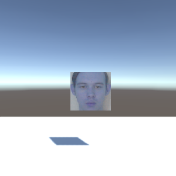

# Разработка решения для взаимодействия компьютерного зрения с виртуальным окружением

## Аннотация
В современном мире существует множество сфер в которых используется виртуальное пространство. Оно позволяет решать задачи архитектурной визуализации, моделирования интерьеров, так же используется для тренинг-симуляторов и визуализации бизнес данных. Для улучшения работы с виртуальным пространством можно использовать компьютерное зрение.
Предлагаемое решение представляет собой библиотеку, работающую в интегрированной среде разработки Unity, позволяющий взаимодействовать с библиотекой OpenCV. Написанная библиотека предоставляет информацию, полученную библиотекой OpenCV, в среду разработки Unity и наглядно показывает возможности взаимодействия компьютерного зрения и виртуального пространства.  Текущее решение может быть использовано в будущем для создания инструмента управления в виртуальном пространстве посредством жестов используя алгоритмы компьютерного зрения.

## Введение
В настоящее время для построения, моделирования, симуляций и визуализации данных активно применяется виртуальное пространство [1]. Практически в каждой из этих сфер необходимо реализовать взаимодействие между пользователем и виртуальным пространством. Для улучшения работы с виртуальным пространство можно использовать компьютерное зрение.
Компьютерное зрения можно использовать как элемент управления для быстро развевающихся, на данный момент, технологий виртуальной реальности как бесплатный аналог контроллерам виртуальной реальности. Так же компьютерное зрение открывает множество возможностей для работы со сценой, созданной при помощи сканирования окружения камерой, например, для дизайна или для работы с дополненной реальностью.  Основной проблемой является создание достаточно удобного подхода построения и взаимодействия объектов на сцене виртуального пространства при помощи компьютерного зрения. Разработанное решение можно будет использовать как в развлекательной среде, так и для различных визуальных демонстраций, разработки дизайна и других задач, которые применяю виртуальное пространство.   Для выполнения этой цели будут определены методы и решения для задач построения сцены, будут изучены средства компьютерного зрения и разработана библиотека обеспечивающая возможность взаимодействия компьютерного зрения и виртуального пространства. В данном подходе для решения задач компьютерного зрения будет использоваться библиотека OpenCV [2]. Для задач построения виртуального пространства будет использоваться интегрированная среда разработки Unity [3].

## Обзор средств
Для решения задачи распознавания лиц существует множество инструментов, из которых наиболее распространенным является библиотека с открытыми исходными кодами OpenCV. OpenCV (Open Source Computer Vision) это популярная библиотека компьютерного зрения, разработанная компанией Intel в 1999 году. Кроссплатформенная библиотека нацелена на обработку изображений в режиме реального времени, и включает в себя свободную реализацию новейших алгоритмов компьютерного зрения [4]. Решаемая задача сводится к поиску некоторого заранее определенного объекта на изображении. Наиболее перспективным и известным методом решения данной задачи (в условиях ограниченных аппаратных ресурсов) являются алгоритмы на основе каскадов признаков, наиболее известными из которых являются следующие два алгоритма [5]:
* алгоритм Виолы и Джонса [6];
* алгоритм LBP (Local Binary Patterns) [7].
Данные алгоритмы изначально создавались для распознавания лиц, однако впоследствии показали свою применимость практически к любым видам объектов, таким как человеческая фигура, автомобили, цифры. Поскольку система должна обеспечивать достаточный уровень быстродействия, то авторами был выбран алгоритм LBP, так как он является более быстрым в сравнении с алгоритмом Виолы–Джонса [5].
Для решения задачи визуализации сцен виртуального пространства в связи с удобством использования был выбран Unity. Игровой движок Unity — это инструмент для разработки двух и трехмерных приложений и игр для ОС Windows и OS X. Созданные с помощью Unity приложения работают на большинстве распространенных операционных систем (Windows, OS X, Windows Phone, Android, iOS, Linux), а также на ведущих игровых приставках. Поддерживается создание даже браузерных приложений. Проекты, созданные с помощью Unity, поддерживают DirectX и OpenGL.

## Выбранный метод решения
Решение представляет собой библиотеку, работающую в интегрированной среде разработки Unity, позволяющий взаимодействовать с библиотекой OpenCV. Было решено для демонстрации создать прототип, использующий алгоритмы распознавания лиц. При помощи библиотеки OpenCV, используя алгоритм lbp каскадов, распознаётся и вырезается лицо, и передаться в Unity.
Решение должно быть удобным в использовании, правильно реагировать на ситуации, когда не удаться обнаружить ни одного лица или, когда лиц несколько. 
Таким образом, ключевые требования можно описать следующим образом:
* Удобное использование;
* Обработка ситуация, когда не было обнаружено лиц;
* Обработка ситуация с множеством лиц;
* Достаточно высокую скорость обработки и передачи данных в Unity.

## Описание решения
Разработка решения взаимодействия компьютерного зрения с виртуальным окружение производилась в три этапа.  
* На первом этапе был разработан метод использования OpenCV для взаимодействия с Unity.
* На втором этапе была создана библиотека сохраняющая распознанное лицо.
* На третьем этапе разработано решение передающее изображение в текстуру объектов. 

Разработанная библиотека перехватывает изображение видео камеры, используя метод lbp каскадов распознает лицо, вырезает его и передает в отдельный объект. Данный объект сохраняется как набор байтов и передаться в Unity. На стороне Unity объект который использует написанный скрипт, применяет к своей текстуре полученный набор байтов через метод LoadRawTextureData. Текстура применяется каждый кадр, обеспечивая трансляцию видео на объект. Данный подход можно использовать для видео чатов не посредственно в виртуальном окружении или для передачи данных на сцену виртуальной реальности.

В рамках работы были пройдены этапы анализа предметной области, на основе которых были получены данные и был разработан подход взаимодействия компьютерного зрения со сценами виртуального пространства, а также выполнены следующие задачи:* Анализ используемых решений;
* Определен список необходимых требований;
* Выбран метод для взаимодействия компьютерного зрения с виртуальным окружением;
* Написана библиотека передающая распознанное лицо в Unity;
* Приведён пример использования написанной библиотеки;
* Описаны возможные расширения написанной библиотека с целью повышения качества и удобства работы с ней;
* Описаны возможные направления развития взаимодействия компьютерного зрения и виртуального окружения.

## Заключение
Текущее решение наглядно показывает возможности взаимодействия компьютерного зрения и виртуального пространства, однако на данный момент не предлагает широких возможностей. В процессе работы была разработана библиотека использующая функционал библиотеки компьютерного зрения OpenCV для работы с интегрированной средой разработки Unity, описан подход их взаимодействия и приведён пример использования. Решение, на данный момент, имеет не большой функционал, но имеет большой потенциал для развития.
В дальнейших планах изучить более подробно подходы работы компьютерного зрения, создать и использовать алгоритмы для поиска не только лиц, но и рук, на основе которых можно создать прототип взаимодействия в среде виртуального пространства жестами рук.

## Список литературы
1. Бочкарев Н.А., Молотов Р.С. Подходы к трансформации объектов виртуальных пространств в среде Unity.
2. Официальный сайт библиотеки OpenCV. URL: https://opencv.org/
3. Официальный сайт Unity3D. URL: http://unity3d.com/ru/
4. Каипбергенов Б.Т., Кадыров А.А. Распознавание лиц на примере библиотеки OpenCV.
5. Н.Г. Макагонов. Детектирование объекта управления с помощью компьютерного зрения в системе «шарик на балансире»
6. Viola P., Jones M. J. Robust real-time face detection // International journal of computer vision. – 2004. – Т. 57. – № 2. – С. 137–154.
7. Liao S., Law M. W. K., Chung A. Dominant local binary patterns for texture classification // Image Processing, IEEE Transactions on. –2009. – Т. 18. – №. 5. –С. 1107–1118.