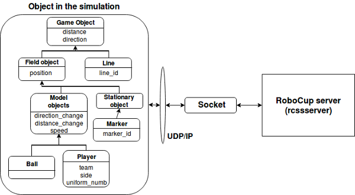
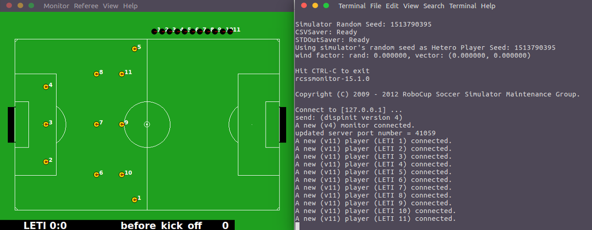

# Архитектура автономных интеллектульных агентов для многоагентной среды симулятора RoboCup

## Аннотация

В настоящее время перспективной является задача управления группой роботов, действия которых направлены на достижение общей цели. Актуальность обуславливается появлением в различных сферах деятельности сложноустроенных систем, состоящих из различных узлов и компонентов. Такие системы можно представить как объект управления группой. В данной работе рассматривается подобная задача на основе игроков-роботов вирутального футбола. В процессе решения будет спроектирована и разработана архитектура компонента, позволяющая управлять и координировать группу агентов.

## Введение

Задача управления группой роботов заключается в нахождении и реализации таких действий отдельного робота, которые бы приводили к оптимальному достижению групповой цели, определенной некоторыми критериями. Скоординированные и согласованные действия такой группы могут оказать значительное влияние на эффективность выполняемых процессов. Одной из сфер применения групповой стратегии управления в условиях организованного противодействия является виртуальный футбол. Данная игра представляет собой наглядную модель, которая позволяет исследовать возможности различных алгоритмов управления противоборствующими группами роботов. 

В настоящее время интерес в мире к рассматриваемой задаче стремительно возрастает, что подтверждается большим числом участников соревнований по виртуальному футболу среди роботов, проводимых в рамках чемпионатов RoboCup [1]. Однако разрабатываемые проекты в большинстве своем имеют закрытый, либо частично открытый исходный код, а также в них отсутствует гибкость в настройке роботов-агентов. Текущие проблемы замедляют темпы развития подобного рода турниров, ввиду высокого порога вхождения, отсутствия удобных компонентов для разработки и тестирования. Поэтому целью данной работы является проектирование и разработка архитектуры компонента с открытым исходным кодом для управления группой роботов. 

Для достижения поставленной задачи необходимо подробнее ознакомиться с компонентами RoboCup, провести анализ участников.

## Обзор предметной области

Футбольную составляющую соревнований RoboCup можно разделить на следующие категории(лиги):

1. Simulation League — состязание компьютерных программ.
2. Small Size League — состязание роботов футболистов диаметром не более 18см.
3. Middle Size League — состязание роботов футболистов диаметром не более 50см.
4. Standard Platform League — состязание роботов футболистов одинаковых для обеих команд.
5. Humanoid League — дизайн и программное обеспечение роботов создаётся командами-участниками самостоятельно.

Стоит отметить, что роботы, принимающие участие в подобных соревнованиях, как правильно, являются дорогостоящими, а их техническая реализация и подготовка не имеет отношения к задаче группового управления. Поэтому выбор сделан в пользу Simulation League, позволяющей сконцетрироваться на разработке архитектуры агентов и алгоритма их взаимодействия между собой, а также с агентами команды-соперника.

### RoboCup Simulation League

Для организации игрового процесса в Simulation League используются следующие условия:

1. Прямоугольное игровое поле, размерами , где  длина и ширина поля соответственно.
2. В игре участвуют две команды роботов-агентов, по  игроков с каждой стороны: , где . Обычно количество агентов одной команды ограничивается числом 12, в которое входят: 11 полевых футболистов и 1 тренер.
3. Каждый объект на игровом поле имеет ряд параметров 3-х типов:
    * постоянные, к ним относятся масса объекта , радиуc , максимальная скорость  и другие;
    * переменные: координаты , скорость  и еe направление ;
    * параметры управления для роботов-игроков: линейное ускорение , угловая скорость  (считается, что еe вектор ортогонален плоскости поля, а значения угловой скорости могут изменяться мгновенно)[1].

Simulation League взаимодействует с RoboCup сервером(*rcssserver*) посредством UDP/IP - протокола пользовательских датаграмм. С его помощью каждый агент отправляет запрос для регистрации своих действий, в то время как сервер, получая эту информацию, обеспечивает робота-агента необходимыми данными, такими, как: его местоположение на поле, физические кондиции и другое. Следует понимать, что сервер работает с дискретными временными интервалами(циклами). Таким образом, низкая производительность игрока, обеспечивающая несвоевременный обмен данными с сервером в заданный цикл, влияет на производительность команды в целом [2]. Структура Robo-сервера представлена на рисунке 1.  

Инструментом визуализации в Simulation League является встроенный компонент - монитор(*rcssmonitor*), который позволяет также управлять игровым процессом, а именно: начинать и останавливать игру, менять расстановку на поле и другое). Часто для анализа симуляции, выявления сильных и слабых сторон команды применяется *rcsslogplayer*, представляющий собой видеоплеер с возможностью воспроизводить уже проведенные футбольные матчи.

Изложенные выше компоненты Simulation League являются встроенными, поддающимися только конфигурации с целью соответствия выбранному направлению. Однако такие компоненты, как робот-агент и тренер полностью реализуются программистом, используя методы сервера. Тренер является виртуальным участником симуляции, способным координировать действия команды засчет использования персональных, а также общекомандных сообщений. 

Агент представляет собой виртуального робота, являясь центральным звеном системы. Реализация команды, состоящей из подобных участников, с различными функциями на поле, а также отличным друг от друга ситуационным поведением, позволяет решить задачу группового управления роботами. Агенты в симуляторе RoboCup имеют 3 группы датчиков, которые несмотря на отсутствие технической составляющей, просчитываются на сервере. Эта информация дает ясное представление об окружающей среде:

1. Слуховой датчик позволяет принимать команды от партнеров по команде, тренера, рефери.
2. Визуальный датчик применяется агентами вычисления для расстояния между объектами на игровом поле в своей зоне видимости.
3. Физический датчик определяет основные параметры, связанные с выносливостью, скоростью и другое.

Стоит отметить, что поведение агента включает в себя реализацию, как архитектуры, так и математической модели, позволяющей правильным образом реагировать на происходящие события. Данная статья раскрывает понятие архитектуры роботов-агентов, поэтому критерии, выделенные далее для сравнения с командами, участвующими в данной лиге, касаются исключительно данного аспекта.

## Сравнение команд-участников

Для сравнения были выбраны команды-победители, участвующие в Simulation League. Ограничение состоит в неполном открытом доступе к ресурсам команд.

1. **UvA TriLearn**[4] - команда из Амстердама, победитель RoboCup Simulation League 2003. Исходный код открыт частично, отсутствует командный модуль принятия решений. Присутствуют механизмы взаимодействия с сервером и построения модели агента. Проект реализован на языке программирования C++ [3].
2. **Brainstormers**[5] - проект из университета Osnabrück, Германия. Победитель RoboCup Simulation League 2005. Как и в случае с предыдущей командой разработчики убрали из открытого доступа модуль принятий решений, оставив модули для одиночных агентов. Проект реализован на языке программирования C++ [3].
3. **CM United**[6] - команда-победитель RoboCup 1999, США.

### Критерии сравнения

- **Полноценное использование возможностей rcssserver** - Robo-сервер реализует множество методов для отслеживания характеристик агентов, помогая тем самым получить адекватную оценку действиям агента на игровом поле. Полноценное использование возможностей сервера позволяет получить более отчетливое представление об агенте и команде в целом.
- **Гибкие настройки агентов** - данный критерий позволяет изменять параметры компонентов из терминала запуска или графического интерфейса, не анализируя код при этом. Гибкость достигается засчет возможности подобной настройки во время симуляции игрового процесса.
- **Двусторонняя симуляция агентов** - использование аналогичных роботов-агентов при реализации двух противоборствующих команд. Такая возможность позволит правильно локализовать и устранить уязвимости команды, для которой генерируется однотипный соперник. Подходит для тренировки и оттачивания алгоритма и архитектуры агентов.

### Выводы по итогам сравнения

Критерий\Команда                       | UvA TriLearn |   Brainstormers    | CM United
---------------------------------------| ------------ | ------------------ | ---------
1 Полноценное использование rcssserver |      +       |         +          |    -
2 Гибкие настройки агентов             |      -       |         -          |    -
3 Двусторонняя симуляция агентов       |      -       |         +          |    - 

Во всех командах отсутствует возможность гибкой настройки агентов, что ограничивает пользователей,использующих подобную архитектуру во время разработки и тестирования. Стоит также отметить, что команда Brainstormers реализована исключительно под семейство Linux-подобных систем, такой принцип ведет к ограничению мультиплатформенности. Но несмотря на это команда Brainstormers лучше других соответствует критериям, предъявляемым к разрабатываемому компоненту в данной работе.

## Архитектура робота-агента

Решение представляет собой компонент, выполняющий следующие глобальные функции:

1. Настройка подключения и передача параметров серверу(*rcssserver*).
2. Создание структуры агента и генерирование подобных агентов в представление(*rcssmonitor*).

На рисунке 2 схематически изображена структура компонента, определенная исходя из представленных выше ключевых функций компонента. 

Структура агента описана по принципу объекто-ориентированного программирования. Такой подход выбран в силу того, что серверная часть реализована аналогичным образом, что позволяет максимально удобно использовать все возможности подобного подхода. Ниже представлен список основных классов, составляющих архитектуру агента, которая в дальнейшем будет использоваться для реализации поведенческой модели принятия решений:

1. Класс **WorldModel** хранит в себе основные свойства сервера, описывающие начальные параметры агента или параметры по умолчанию. Его по наследуют остальные классы для "реактивного" изменения свойств агента, а также для составления картины окружающего мира. Содержит методы для вычисления всех базовых действий игроков на поле и последствий, наступивших после, являясь, таким образом, основным классом, с которого начинается разработка. Ниже описаны несколько методов, используемых в *WorldModel*:
    * *isKickOff* - метод, подсказывающий командам о начале игры после ухода мяча за лицевую линию;
    * *getStamina* - метод, получающий значение выносливости определенного агента;
    * *triangulateDirection* - метод, определяющий абсолютный угол обзора агента на основе значений углов флагов игрового поля.
2. Класс **GameObjects** определяет все объекты игрового поля, начиная от координатных флагов, заканчивая мячом и агентом.
3. Класс **Agent** хранит все методы, связанные агентом, а также его перемещением во время матча. Примером могут являться следующие:
    * *think* - метод, выполняющийся на каждой итерации цикла матча и просчитывающий следующий шаг агента, начиная от ввода мяча и заканчивая атакой;
    * *messageLoop* - метод, принимающий сообщения от сервера.
4. Класс **Handler** занимается обработкой сообщений от сервера, тренера или партнеров по команде. После определения типа, значения данные передаются в дочерние классы. Можно выделить следующие методы:
    * *handleSee* - принимает информацию ввиде сообщений и после парсинга структурирует и группирует ее, тем самым делая сообщения понятными по типу и значению;
    * *handleHear* - разбивает и преобразует информацию, полученную с использованием слухового датчика.
5. Класс **Socket** - отвечает за подключение отдельных агентов.
6. Класс **Exceptions** - хранит все глобальные ошибки.

Класс **Agent** наследует свойства и методы для трех дочерних классов, определяющих роли на игровом поле: защитник, полузащитник, нападающий. Отличия в поведении агентов прослеживаются при тактическом построении, длине и типу передач, дриблинге на своей половине поля и другое. Пока те или иные правила поведения ограничиваются переопределением базовых методов и свойств класса **Agent**, в дальнейшем планируется использовать подход конечного автомата не только для деления агентов по ролям, но и в определении интеллектуального поведения.

Помимо вышеописанных классов присутствует класс инициализации компонента, в котором последовательно подключаются агенты на сервер, каждый со своей ролью, а также ведется хронометраж действий игроков в терминале. Процесс симуляции стартового построения представлен на рисунке 3.

В качестве основного языка разработки использовался JavaScript. С помощью скрипта на основе библиотеки Nodejs удалось установить подключение с сервером по UDP, TypeScript же использовался для реализации основных классов и методов агента.

## Заключение

В результате данной работы была спроектирована и представлена архитектура компонента с открытым исходным кодом, который позволяет подключиться к Robo-серверу и моделировать агентов с определенной ролью на игровом поле. Также для достижения цели были рассмотрены основные элементы турнира по виртуальному футболу среди роботов RoboCup. Дальнейшее развитие по данной задаче предполагает реализацию интеллектуальной модели поведения агентов на основе конечных автоматов, которые будут использовать архитектуру, представленную в данной работе.

## Список литературы

1. И.А.Каляев, А.Р.Гайдук, С.Г.Капустян, "Модели и алгоритмы коллективного управления в группах роботов", 2009, 280 pages, ISBN 978-5-9221-1141-6
2. M.Chen, K.Dorer, "RoboCup Soccer Server", 2003, 150 pages
3. P.Bradfield, "Creating agents for the RoboCup Soccer Simulator using evolutionary techniques", 2007, 70 pages
4. UvA TriLearn, jellekok.nl. URL: http://www.jellekok.nl/index.php?cat=robocup (дата обращения 12.12.2017)
5. Brainstormers, sourceforge.net/projects/bsrelease, https://sourceforge.net/projects/bsrelease/files/ (дата обращения 13.12.2017) 
6. CM United, http://www.cs.cmu.edu/~mmv/papers/LNAI97-robot.pdf, (дата обращения 12.12.2017)