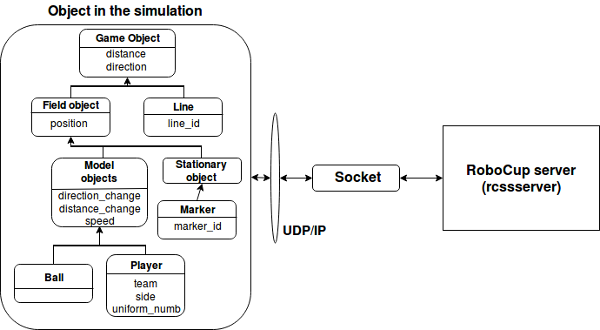
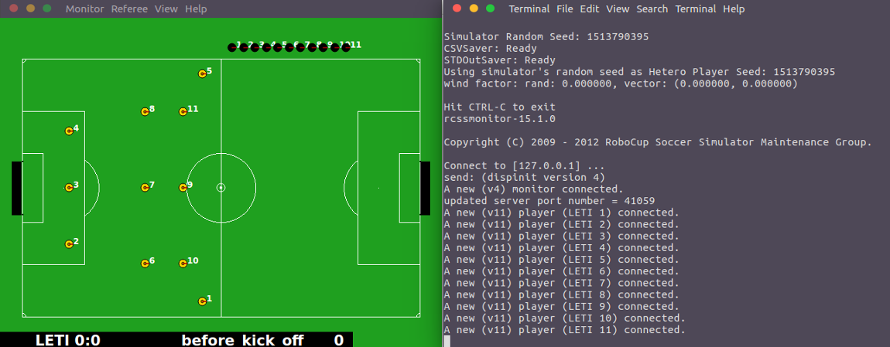

Решение представляет собой компонент, выполняющий следующие глобальные функции:

1. Настройка подключения и передача параметров серверу(*rcssserver*).
2. Создание структуры агента и генерирование подобных агентов в представление(*rcssmonitor*).

На рисунке 2 схематически изображена структура компонента, определенная исходя из представленных выше ключевых функций компонента. 

Структура агента описана по принципу объекто-ориентированного программирования. Такой подход выбран в силу того, что серверная часть реализована аналогичным образом, что позволяет максимально удобно использовать все возможности подобного подхода. Ниже представлен список основных классов, составляющих архитектуру агента, которая в дальнейшем будет использоваться для реализации поведенческой модели принятия решений:

1. Класс **WorldModel** хранит в себе основные свойства сервера, описывающие начальные параметры агента или параметры по умолчанию. Его по наследуют остальные классы для "реактивного" изменения свойств агента, а также для составления картины окружающего мира. Содержит методы для вычисления всех базовых действий игроков на поле и последствий, наступивших после, являясь, таким образом, основным классом, с которого начинается разработка. Ниже описаны несколько методов, используемых в *WorldModel*:
    * *isKickOff* - метод, подсказывающий командам о начале игры после ухода мяча за лицевую линию;
    * *getStamina* - метод, получающий значение выносливости определенного агента;
    * *triangulateDirection* - метод, определяющий абсолютный угол обзора агента на основе значений углов флагов игрового поля.
2. Класс **GameObjects** определяет все объекты игрового поля, начиная от координатных флагов, заканчивая мячом и агентом.
3. Класс **Agent** хранит все методы, связанные агентом, а также его перемещением во время матча. Примером могут являться следующие:
    * *think* - метод, выполняющийся на каждой итерации цикла матча и просчитывающий следующий шаг агента, начиная от ввода мяча и заканчивая атакой;
    * *messageLoop* - метод, принимающий сообщения от сервера.
4. Класс **Handler** занимается обработкой сообщений от сервера, тренера или партнеров по команде. После определения типа, значения данные передаются в дочерние классы. Можно выделить следующие методы:
    * *handleSee* - принимает информацию ввиде сообщений и после парсинга структурирует и группирует ее, тем самым делая сообщения понятными по типу и значению;
    * *handleHear* - разбивает и преобразует информацию, полученную с использованием слухового датчика.
5. Класс **Socket** - отвечает за подключение отдельных агентов.
6. Класс **Exceptions** - хранит все глобальные ошибки.

Класс **Agent** наследует свойства и методы для трех дочерних классов, определяющих роли на игровом поле: защитник, полузащитник, нападающий. Отличия в поведении агентов прослеживаются при тактическом построении, длине и типу передач, дриблинге на своей половине поля и другое. Пока те или иные правила поведения ограничиваются переопределением базовых методов и свойств класса **Agent**, в дальнейшем планируется использовать подход конечного автомата не только для деления агентов по ролям, но и в определении интеллектуального поведения.

Помимо вышеописанных классов присутствует класс инициализации компонента, в котором последовательно подключаются агенты на сервер, каждый со своей ролью, а также ведется хронометраж действий игроков в терминале. Процесс симуляции стартового построения представлен на рисунке 3.

В качестве основного языка разработки использовался JavaScript. С помощью скрипта на основе библиотеки Nodejs удалось установить подключение с сервером по UDP, TypeScript же использовался для реализации основных классов и методов агента.