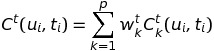
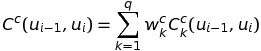

# Использование суффиксных деревьев для оптимизации поиска элемента звуковой базы по технологии Unit Selection

## Аннотация
Синтез речи широко используется для различных задач, таких как, разработка речевого пользовательского интерфейса, чтение произвольного текста без предварительной разметки. Наличие доступных, качественных реализаций голосового пользовательского интерфейса, весьма актуально для людей с ограниченными возможностями. Для получения качественных результатов, компилятивный, так же называыемый компиляционным или конкатенативным, синтез требует существенных вычислительных мощностей для обработки большой звуковой базы.
В данной работе рассматриваются способо увеличения скорости поиска элемента звуковой базы по технологии Unit Selection, в частности с помощью суффиксных деревьев.

## Введение
Главной чертой метода Unit Selection[2] является то, что синтез речи осуществляется не из базы аллофонов, дифонов, слов или других фонетических единиц, каждая из которых представлена единственным элементом, а из элементов вырезанных из предложений естествнной речи. Предоставляя лучшее качество синтезированной речи (при наличии качественной речевой базы), компилятивный синтез требует существенных вычислительных мощностей. Предполагается, что использование суффиксных деревьев позволит снизить вычислительную стоимость синтеза.
Таким образом, основной проблемой является вычислительная сложность алгоритмов компилятивного синтеза речи, необходимо исследовать технологии, представляющие возможности оптимизации операции поиска.

## Аналоги

### Алгоритм Витерби
Алгоритм Витерби (в некоторых источниках поиск Витерби, решетчатая функция декодирования Витерби) алгоритм - динамического программирования, реализующий поиск наиболее подходящего списка состояний (называемого путём Витерби), который в контексте цепей Маркова получает наиболее вероятную последовательность произошедших событий. Для построения матрицы переходов используются стоимости замены и связи[3].

### Алгоритм Витерби с отсечениями
Представляет собой алгоритм Витебри, с добавлением методики отсечения (англ. pruning), направленной на уменьшение числа рассматриваемых последовательностей. Используются две основыные методики отсечения: предварительный отбор (англ. pre-selection) и отсечение лучей (англ. beam pruning). Предварительный отбор оставляет фиксированное количество лучших кандидатов для каждого элемента, отсечение лучей рассматривает фиксированное количество локально оптимальных путей. Использование любой методики отсечения создаёт риск отсечь оптимальный путь.

## Критерии сравнения аналогов
Рассмотрен ряд критериев, на основе который выполнено сравнение используемых алгоритмов.
Основным критерием является скорость работы алгоритма, т.к. для для многих задач актуален вопрос синтеза речи в реальном времени. До сих пор, не смотря на рост вычислительных мощностей вычислительных устройств, скорость поиска остается серьезной проблемой.
Эффективность алгоритма применительно больших речевых баз, с более чем 50 000 элементов, так же является немаловажной характеристикой, поскольку размер базы определяет качество синтезируемой речи.

## Сравнения аналогов
В таблице 1 приведены используемые алгоритмы и критерии, благодаря которым можно осуществить поверхностное сравнение существующих аналогов.

Таблица 1 - сравнение аналогов

Аналог\Критерий | Вычислительная сложность | Затраты памяти | Эффективность для больших баз
----------------|--------------------------|----------------|------------------------------
Алгоритм Витерби| O(K^2 * N) | O(KN) | - 
Алгоритм Витерби с отсечениями| O(K^2 * N * R) | O(KN) | + 

N - количество искомых элементов  
K - размер матрицы переходов  
R - константа определяемая выбранной стратегией отсечения  

## Выбор метода решения
В результате проведенного анализа существующих алгоритмов синтеза речи по технологии Unit Selection, определена главная проблема - скорость поиска подходящих элементов, для больших, 50 000 и более элементов, речевых баз. Следует отметить, что в работе не рассматривается вопросы разметки звуковой базы, предобработки, эффективности использования различных метрик и их комбинаций для определения стоимости замены и стоимости связи, постобработки выбранных юнитов, способов программной реализации суффиксного дерева.
Данный подход позволит использвать разработанный алгоритм не только для чистой технологии Unit Selection, но и для метода гибридного синтеза. Поскольку в гибридном методе, к примеру, с использованием скрытых марковских моделяй, статистический блок определяет акустические признаки, к примеру частоту основного тона и длительность[7], элементов, после чего, на основе функции стоимости, методом Unit Selection определяется оптимальная последовательность.
Таким образом, определены два возможных вектора работы: разработка непосредственно алгоритма поиска элемента в базе, и разработка алгоритма вычисления весовых коэффициентов используемых в построении оценки стоимости связи. Приоритетным направлением является именно алгоритм поиска, т.к. весовые коэффициенты могут задаваться разработчиком вручную.
Любой из разработанных алгоритмов, должен соответствовать следующих качествам:

- скорость лучше чем у поиска Витерби;
- гарантированное нахождение лучшего пути.

## Описание метода решения
Как уже упоминалось ранее, в данной работе рассматривается исключительно алгоритм поиска элемента звуковой базы. Пускай даны требуемые параметры звуковых элеметов, необходимых для синтеза некоторого предложения или слова. Задача Unit Selection - выбрать наилучшую последовательность реализаций звуковых элементов по полученным параметрам.[2]

В качестве метрики характеризующей насколько элемент *u* подходит для синтеза текущей фонетической единицы, используются понятия стоимости замены (англ. target cost) и стоимости связи (англ. concatenation cost). Данные оценки представляют собой взвешенные суммы различий в признаках между двумя элементами. Используемые признаки не регламентируются Unit Selection и выбираются разработчиком. Как правило используются следующая информация: [4][1]

- частота основного тона
- длительность
- контекст
- позиция элемента в слоге/слове
- количество ударных слогов
- энергия
- спектральные параметры:
  - MFCC (Mel Frequency Cepstral Coefficients);
  - LPC (Linear Predictive Coding Coefficients);
  - LSF (Line Spectral Frequencies);
  - MCA (Multiple Centroid Analisys).

Множество исследований, имеющих своей целью определить какая комбинация спектральное представление/метрика даст лучшую корреляцию с человеческим восприятием речи, не привели к однозначному ответу. Однако, можно отметить, что расстояние Махаланобиса на коэффициентах MFCC даёт хорошие результаты в большинстве тестов.[1]

Таким образом, стоимость замены, характеризующая близость выбранного элемента к искомому, вычисляется по формуле:

  

где *C* - расстояние между *k*-ми характеристиками элементов,
*w* - вес для *k*-ой характеристики,  
*u* - элемент из звуковой базы.  

А стоимость связи, отображающая насколько хорошо сочетаются два последовательно выбранных элемента:  

  

где *C* - расстояние между *k*-ми характеристиками элементов,  
*w* - вес для *k*-ой характеристики.  

Общая стоимость последовательности из *n* элементов, вычисляется как сумма описанных выше стоимостей:  

  

Поскольку различия одних характеристик оказывают больше влияния, чем различия других характеристик, возникает необходимость использования весовых коэффициентов *w*. Существуют следующие методики определения *w*:

- автоматический подбор на основе объективной меры;
  Идея - найти набор тестов, который минимизирует аккустическое расстояние между синтезированной и эталонной речью. Задача определения данной метрики является отдельной проблемой.
- перцепционный;
  Проводится эксперимент, в ходе которого, испытатели оценивают качество синтезированной речи. Полученные оценки используют для тренировки модели.
- ручная настройка.
  Коэффициенты полностью определяются разработчиком системы.

Задача Unit Selection - выбрать множество элементов из звуковой базы таким образом, чтобы минимизировать общую стоимость. Классическим решением является использование поиска Витерби с отсечениями, поскольку полный поиск является слишком долгой операцией. Используются две основыные методики отсечения: предварительный отбор (англ. pre-selection) и отсечение лучей (англ. beam pruning). Предварительный отбор оставляет фиксированное количество лучших кандидатов для каждого элемента, отсечение лучей рассматривает фиксированное количество локально оптимальных путей.

### Оптимизация поиска Витерби
Наиболее простой в исследовательском плане, является попытка оптимизации существующего алгоритма поиска Витерби программными методами. К примеру, хранение оценок стоимости для наиболее используемых элементов, различных механизмов хэширования и индексирования звуковой базы. Поскольку данный подход представляет собой по большей части инженерную работу, он рассматривается как наименее приоритетный.

### Использование суффиксного дерева
Определение суффиксного дерева и алгоритмов его построения, подробно рассмотрено в [5]. Вкратце, суффиксное дерево - представление строки символов в виде ориентированного графа, позволяющее решать многие задачи поиска по строкам за линейное время, с использованием линейной памяти.

Суффиксные деревья позволяют решать множество задач поиска на неструктурированных данных. Для строки T длинной *m*, суффиксное дерево занимает *O(m)* памяти, построение дерева требует время *O(m)*. Поиск вхождения строки S длинной *n* в строку T, занимает *O(n)*. [3]
Не смотря на то, что обычно, суффиксные деревья используются для задач точного совпадения, они позволяют так же решать задачи неточного совпадения (нечеткого поиска), необходимые для Unit Selection.

Сами по себе, суффиксные деревья не предоставляют достаточного набора методов для получения желаемого решения. Тем не менее, для задачи о k несовпадениях, решение базирующееся на суффиксных деревьях даёт алгоритм получения решения за линейное время, и требующий линейной памяти.
Данное решение достигается посредством использования гибридного динамического программирования – суффиксные деревья используются для решения подзадач.
Минусом является отсутствие хорошего обобщения для задачи взвешенного выравнивания. Существующий метод Гоннета и Беза-Йетса [3] выглядит перспективной альтернативой поиску Витерби.

Однако, для применения суффиксных деревьев необходимо адаптировать их структуру для получения оценок стоимости. В идеале, необходимо рассчитывать стоимость связи не только для 2-х соседних элементов, а для неограниченного их количества. Использование таких оценок затруднительно на практике, из-за больших расходов памяти, но лучше вынести данное ограничение в программную реализацию, чем в работу алгоритма.

## Заключение
В данной работе изучена проблема поиска элемента звуковой базы при синтезе речи по технологии Unit Selection для больших речевых баз. Изучены существующие реализации, проанализированы их проблемы, а именно низкая скорость работы. Рассмотрено использование суффиксных деревьев, с целью оптимизации поиска элемента звуковой базы. Выявлены и описаны проблемы и ограничения использования суффиксных деревьев. Дальнейшим направлением исследований может быть реализация суффиксного дерева, для решения задач поиска в методе Unit Selection, разработка алгоритма направленного на повышение производительности гибридной модели речевого синтеза.

## Источники
1. Рыбин С. В. СИНТЕЗ РЕЧИ Учебное пособие по дисциплине "Синтез речи". – СПб: Университет ИТМО, 2014. – 92 с.
2. Black A.W., Hunt A.J. Unit Selection in a Concatenative Speech Synthesis Using a Large Speech Database // In Proceedings of ICASSP 96. Atlanta, Georgia, 1996. Vol. 1, pp. 373-376.
3. Гасфилд Дэн Строки, деревья и последовательности в алгоритмах: Информатика и вычислительная биология / Пер. с англ. И.В.Романовского. - СПб.: Невский Диалект; БХВ-Петербург, 2003. - 654 с.: ил.
4. Vepa J. Join Cost for Unit Selection Speech Synthesis // University of Edinburg, 2004