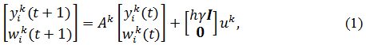

# Методы объединения карт препятствий, составленных группой мобильных роботов

## Аннотация

В данной статье приведён обзор методов объединения карт препятствий, составленных группой мобильных роботов. Был проведён сравнительный анализ методов, в результате которого был предложен метод для объединения карт препятствий, обладающий наилучшими показателями универсальности и масштабируемости среди рассмотренных методов - метод распределённой согласованности.

## Введение

Актуальность темы определяется необходимостью построения карт препятствий для навигации роботов. При наличии эффективного алгоритма объединения карт препятствий роботы, работающие в одной местности, могут использовать промежуточные карты препятствий друг друга для более быстрого построения итоговой карты.
В соответствие с этим возникает необходимость сравнительного анализа методов объединения карт препятствий.

## Обзор предметной области

Для объединения карт препятствий, построенных группой мобильных роботов, существуют следующие алгоритмы:

#### Метод максимизации ожидания с учётом неопределённости (Uncertainty-Aware Expectation Maximization Approach)[1]

Данный метод использует максимизацию ожидания для построения общей карты группой мобильных роботов. При этом расположение роботов полагается неопределённым, что позволяет повысить точность при долгосрочной навигации. 

#### Распределённая согласованность в сетях роботов (Distributed Consensus on Robot Networks)[2]

В данном методе каждый робот строит свою локальную карту, по которой расcчитывает информационные матрицы и вектора, которые передаются другим роботам для построения глобальной карты.

#### SLAM на основе фильтров частиц (Simultaneous Localization and Mapping using Particle Filters)[3]

Данный метод предполагает, что начальное положение роботов неизвестно, и относительное расположение роботов определяется при их встрече. Относительное расположение используется для инициализации фильтра частиц, на основе которого решается задача совместного построения карты препятствий.

### Критерии сравнения аналогов

#### Универсальность

В каких условиях метод неприменим

#### Масштабируемость

При каком количестве роботов метод будет эффективно работать

### Таблица сравнения по критериям

Аналог|Универсальность|Масштабируемость
-|-|-
Метод максимизации ожидания с учётом неопределённости|Данный метод применим при условии, что каждый робот может передать данные любому другому роботу, что может не всегда выолняться, например, по причине удалённости роботов друг от друга|6-7 роботов
Распределённая согласованность в сетях роботов|Данный метод допускает отсуствие возможности передачи данных между некоторыми роботами|8 и более роботов
SLAM на основе фильтра частиц|Данный метод применим при условии, что каждый робот может передать данные любому другому роботу|4 и более роботов

### Выводы по итогам сравнения

Результаты сравнения показывают, что метод распределённой согласованности в сетях роботов обладает лучшими среди рассмотренных методов значениями критериев.

## Выбор метода решения

Результаты сравнения аналогов показывают, что наилучшим методом для объединения карт препятствий, составленных группой мобильных роботов, является метод распределённой согласованности.

Решение рассматриваемой проблемы должно позволять объединять локальные карты препятствий, составленные мобильными роботами, в глобальную карту препятствий, объединяющую информацию о препятствиях из нескольких локальных карт.

Для того, чтобы решение могло быть применено в большем количестве ситуаций, оно должно обладать универсальностью. Для обеспечения возможности ускорения построения глобальной карты путём увеличения количества используемых роботов, решение должно обладать масштабируемостью.

В качестве метода решения был выбран метод распределённой согласованности. Данный метод был выбран в связи с наилучшими показателями масштабируемости и универсальности среди рассмотренных методов.

Данный метод допускает отсутствие связи между несколькими роботами, и может быть применён в ситуации совместной работы 8 и более роботов.

## Описание метода решения

Для решения задачи объединения карт препятствий, составленных группой мобильных роботов, предлагается использовать метод распределённой согласованности[2], так как он является более универсальным и масштабируемым по сравнению с другими рассмотренными методами.

### Входные данные

1. Локальная карта робота i, построенная на k-ом шаге xik, содержащая координаты робота i и координаты признаков, обнаруженных данным роботом
2. Ковариационная матрица элементов локальной карты Σik
3. Матрица наблюдений Hik, все элементы которой принадлежат множеству {0; 1}. Данная матрица связывает локальную карту xik и вектор координат всех роботов и признаков x, таким образом, что верно соотношение xik=Hikx
4. Множество соседей Nik, показывающее, с какими роботами может взаимодействовать робот i на шаге k (робот i не входит в это множество)
5. Количество шагов K
6. Количество роботов n
7. Количество итераций на шаге обновления ввода l
8. Общее количество итераций L
9. Параметр γ>0
10. Размер шага h>0

### Выходные данные

1. Глобальная карта робота i, построенная на k-ом шаге xG;ik, содержащая координаты робота i и координаты признаков, информация о которых получена от других роботов, а также самим роботом в результате наблюдений
2. Ковариационная матрица элементов глобальной карты ΣG;ik

### Алгоритм работы

Введём локальную информационную матрицу Iik и локальный информационный вектор iik для робота i на шаге k, определяемые следующими формулами:  
Iik=(Hik)^T^(Σik)^-1^Hik  
iik=(Hik)^T^(Σik)^-1^xik
Введём обозначение [M]rs, которое означает элемент матрицы M, находящийся в строке r и столбце s. Введём обозначение [v]r, которое означает элемент вектора-столбца v, находящийся в строке r. Выполним расчёт усреднённой информационной матрицы Iavg,ik и усреднённого информационного вектора iavg,ik. Каждый элемент [Iavg,ik]rs, а также каждый элемент [iavg,ik]r, вычисляется по алгоритму 1, при этом в качестве параметра uk используется вектор-столбец, составленный из значений [Iik]rs для i=1, 2, ..., n при расчёте [Iavg,ik]rs, и [iik]r для i=1, 2, ..., n при расчёте [iavg,ik]r. Переменные yk и wk, используемые в алгоритме 1, являются векторами-столбцами размером n. Выходным значением алгоритма 1 является result. После завершения работы алгоритма данное значение записывается в [Iavg,ik]rs или [iavg,ik]r.
Введём обозначение **I**, которое означает единичную матрицу размером n*n. Введём обозначение **0**, которое означает матрицу размера n*n, все элементы которой являются нулями.
Алгоритм 1 будет использовать следующую формулу:  
  
где Ak задаётся формулой 2:  
  
где Lk - матрица Кирхгофа.  
Вычисление Lk осуществляется по следующей формуле: Lk=**I**-WMk, где WMk - весовая матрица, элементы которой соответствуют паре роботов с номерами i и j. Для расчёта элементов WMk используется формула 3:   
  
Алгоритм 1:  
    k = 1  
    yk(0)=0, wk(0) = 0  
    for k = 1, ..., K-1  
    &nbsp; &nbsp; &nbsp; &nbsp; for t=0, ..., l-1  
    &nbsp; &nbsp; &nbsp; &nbsp; &nbsp; &nbsp; &nbsp; &nbsp;            вычислим yik(t+1) и wik(t+1) по формуле 1  
    &nbsp; &nbsp; &nbsp; &nbsp;        end for  
     &nbsp; &nbsp; &nbsp; &nbsp;       yk+1(0)=yk(l), wk+1(0)=wk(l)  
        end for  
        k=K  
        for t=0, ..., L-(K-1)*l-1  
      &nbsp; &nbsp; &nbsp; &nbsp;      вычислим yk(t+1) и wk(t+1) по формуле 1  
        end for  
        result=[yk(L-(K-1)*l)]i   
После вычисления усреднённой информационной матрицы Iavg,ik и усреднённого информационного вектора iavg,ik производится вычисление глобальной карты xG;ik и её ковариационной матрицы ΣG;ik по формулам:
xG;ik=(Iavg,ik)^-1^iavg,ik
ΣG;ik=(Iavg,ik)^-1^/n

## Заключение

В результате работы был проведён сравнительный анализ методов объединения карт препятствий, составленных группой мобильных роботов. Был предложен метод, позволяющий объединять карты препятствий, допускающий отсутствие связи между некотороми роботами, и способный эффективно работать при 8 и более роботах - метод распределённой согласованности. Данный метод, получая на вход локальные карты роботов, формирует глобальную карту, содержащую информацию о расположении роботов и препятствий, обнаруженных несколькими роботами.

Поставленные цели были достигнуты.

В дальнейшем планируется реализовать предложенный метод.

## Список литературы

1. Jing Dong, Erik Nelson, Vadim Indelman, Nathan Michael, Frank Dellaert. Distributed real-time cooperative localization and mapping using an uncertainty-aware expectation maximization approach – Robotics and Automation (ICRA), 2015 IEEE International Conference on
2. Rosario Aragues, Jorge Cortes, Carlos Sagues. Distributed Consensus on Robot Networks for Dynamically Merging Feature-Based Maps -  IEEE Transactions on Robotics
3. Andrew Howard. Multi-robot Simultaneous Localization and Mapping using Particle Filters -  NASA Jet Propulsion Laboratory, Pasadena, California 91109, U.S.A.