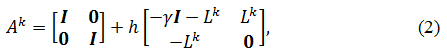

## Описание метода решения

Для решения задачи объединения карт препятсвий, составленных группой мобильных роботов, прделагается использовать метод распределённой согласованности[1], так как он является более универсальным и масштабируемым по сравнению с другими рассмотренными методами.

### Входные данные

1. Локальная карта робота i, построенная на k-ом шаге x<sub>i</sub><sup>k</sup>, содержащая координаты робота i и координаты признаков, обнаруженных данным роботом
2. Ковариционная матрица элементов локальной карты Σ~i~^k^
3. Матрица наблюдений H~i~^k^, все элементы которой принадлежат множеству {0; 1}. Данная матрица связывает локальную карту x~i~^k^ и вектор координат всех роботов и признаков x, таким образом, что верно соотношение x~i~^k^=H~i~^k^x
4. Множество соседей N~i~^k^, показывающее, с какими роботами может взаимодействовать робот i на шаге k (робот i не входит в это множество)
5. Количество шагов K
6. Количество роботов n
7. Количество итераций на шаге обновления ввода l
8. Общее количество итераций L
9. Параметр γ>0
10. Размер шага h>0

### Выходные данные

1. Глобальная карта робота i, построенная на k-ом шаге x~G;i~^k^, содержащая координаты робота i и координаты признаков, информация о которых получена от других роботов, а также самим роботом в результате наблюдений
2. Ковариционная матрица элементов глобальной карты Σ~G;i~^k^

### Алгоритм работы

Введём локальную информационную матрицу I~i~^k^ и локальный информационный вектор i~i~^k^ для робота i на шаге k, определяемые следующими формулами:
I~i~^k^=(H~i~^k^)^T^(Σ~i~^k^)^-1^H~i~^k^
i~i~^k^=(H~i~^k^)^T^(Σ~i~^k^)^-1^x~i~^k^
Введём обозначение [M]~rs~, которое означает элемент матрицы M, находящийся в строке r и столбце s. Введём обозначение [v]~r~, которое означает элемент вектора-столбца v, находящийся в строке r. Выполним расчёт усреднённой информационной матрицы I~avg,i~^K^ и усреднённого информационного вектора i~avg,i~^K^. Каждый элемент [I~avg,i~^K^]~rs~, а также каждый элемент [i~avg,i~^K^]~r~, вычисляется по алгоритму 1, при этом в качестве параметра u~i~^k^ используется значение элемента [I~i~^k^]~rs~ при расчёте [i~avg,i~^K^]~rs~, и [i~i~^k^]~r~ при расчёте [i~avg,i~^K^]~r~. Выходным значением алгоритма 1 является result. После завершения работы алгоритма данное значение записывается в [I~avg,i~^K^]~rs~ или [i~avg,i~^K^]~r~.
Введём обозначение **I**, которое означает единичную матрицу размером n*n. Введём обозначение **0**, которое означает матрицу размера n*n, все элементы котрой являются нулями.
Алгоритм 1 будет использовать следующую формулу:

где A задаётся формулой 2:

где L - матрица Киргофа.
Вычисление L осуществляется по следующей формуле: L=**I**-W~M~, где W~M~^k^ - весовая матрица, элементы которой соответсвуют паре роботов с номерами i и j. Для расчёта элементов W~M~ используется формула 3:

Алгоритм 1:
```{r, tidy=FALSE, eval=FALSE, highlight=FALSE }

        
k = 1
y~i~^k^(0)=0, w~i~^k^(0) = 0
for k = 1, ...; K-1
	for t=0, ..., l-1
		вычислим y~i~^k^(t+1) и w~i~^k^(t+1) по формуле 1
	end for
	y~i~^k+1^(0)=y~i~^k^(l), w~i~^k+1^(0)=w~i~^k^(l)
end for
k=K
for t=0, ..., L-(K-1)*l-1
	вычислим y~i~^k^(t+1) и w~i~^k^(t+1) по формуле 1
end for
result=y~i~^k^(L-(K-1)*l-1)
	


```
После вычисления усреднённой информационной матрицы I~avg,i~^K^ и усреднённого информационного вектора i~avg,i~^K^ производится вычисление глобальной карты x~G;i~^K^ и её ковариционной матрицы Σ~G;i~^K^ по формулам:
x~G;i~^K^=(I~avg,i~^K^)^-1^i~avg,i~^K^
Σ~G;i~^K^=(I~avg,i~^K^)^-1^/n
## Источники

1. Rosario Aragues, Jorge Cortes, Carlos Sagues. Distributed Consensus on Robot Networks for Dynamically Merging Feature-Based Maps -  IEEE Transactions on Robotics
